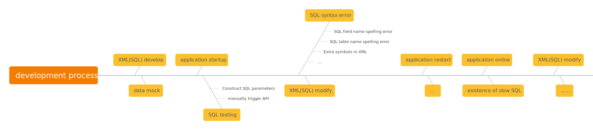
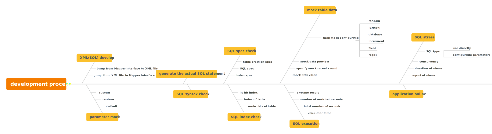
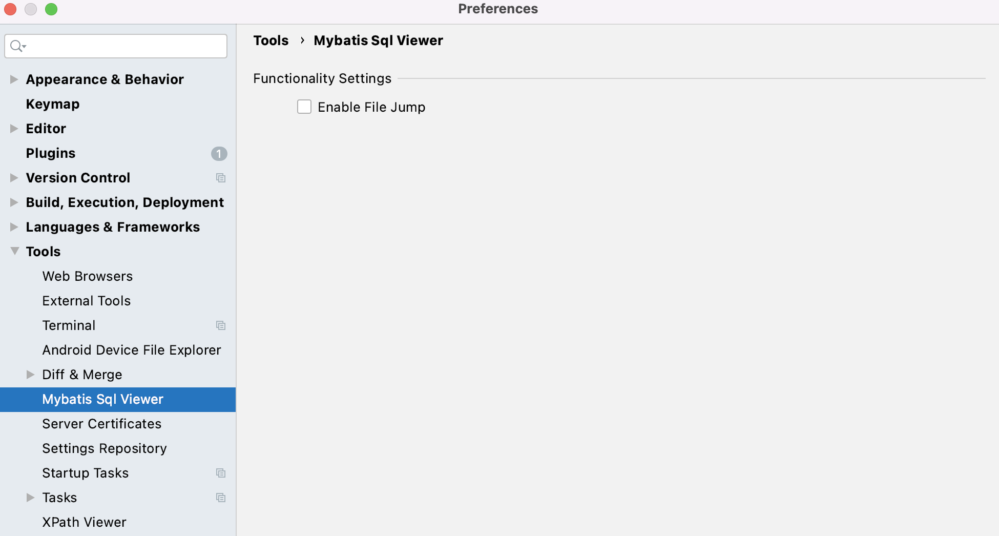

[](https://plugins.jetbrains.com/plugin/18713-mybatis-sql-viewer)
[](https://github.com/linyimin-bupt/mybatis-sql-viewer)
[](https://plugins.jetbrains.com/plugin/18713-mybatis-sql-viewer)
[](https://plugins.jetbrains.com/plugin/18713-mybatis-sql-viewer)
[](https://sonarcloud.io/project/overview?id=linyimin-bupt_mybatis-sql-viewer)
[](https://sonarcloud.io/summary/new_code?id=linyimin-bupt_mybatis-sql-viewer)
[](https://sonarcloud.io/summary/new_code?id=linyimin-bupt_mybatis-sql-viewer)
[](https://sonarcloud.io/summary/new_code?id=linyimin-bupt_mybatis-sql-viewer)
[](https://codecov.io/gh/linyimin-bupt/mybatis-sql-viewer)

[中文](README.md) |
[ENGLISH](README_EN.md)

# 1. Introduction

Although I've been writing CRUD for a long time, I still find it to be a very difficult and tedious task to write good CRUD. The following situations are likely to have been encountered during the development process:

- Writing SQL requires attention to detail. If you make a mistake in the SQL field or table name, you'll need to restart the application after making the correction, which can take several minutes.
- Testing SQL after writing it can be a hassle, especially when it comes to generating test data, especially when there are table associations to consider. The data generated may not be realistic and may even exceed field lengths, which can be frustrating
- After struggling to get SQL to run, there are often additional questions that arise, such as:
    - Does it conform to SQL development spec?
    - Will it hit the index? Which index might it hit?
    - With too little daily environment data, how can we simulate the true production environment?
    - How is its performance? What is the maximum TPS it can achieve? Are there any slow SQL queries when dealing with a large quantity of data?
    - What are the TP99/TP90, maximum RT/average RT, and average TPS?

For developers using MyBatis, they may also face these issues:

- Mapper interface methods and XML tags don't match, and after modifying them, they need to restart (which can also take several minutes).
- An extra comma or semicolon in the XML file, with no error prompt, is only discovered during interface testing, and after correcting it, the system needs to be restarted again (which can also take several minutes).
- Which XML file does this Mapper interface correspond to? It takes more than ten seconds to find it.
- Which Mapper interface does this XML file correspond to? Another ten seconds is spent searching for it.
- How many XML files and SQL statements are there in this project? Are there any slow SQL queries, and do they all conform to development specs?



Based on the aforementioned issues where the application needs to be restarted multiple times, the development experience can be a disaster, especially for applications that take several minutes to start up. To address these issues, the mybatis-sql-viewer plugin was developed, which enables the following capabilities without having to start up the application:


With this plugin, the aforementioned issues can be resolved during the **coding phase**:

- SQL writing can be cumbersome, and if SQL field or table names are written incorrectly, it requires a restart after modification --> **SQL syntax validation**
- Testing SQL after writing it can be troublesome, especially when creating test data, particularly when there are table relationships, and the data content is not realistic and may exceed the field length and cause errors --> **multiple data mocking methods and automatic association**
- After struggling to make SQL work, there are still some questions that need to be answered:
  - Does the SQL code conform to the SQL development Specs? --> **SQL code Specs check**
  - Can the SQL hit an index, and which index might it hit? --> **SQL index check & SQL execution plan**
  - In the daily development environment, how can we simulate the real situation of SQL running in the production environment with large amounts of data? --> **Support for massive data mockup**
  - How is the SQL's performance, what is the maximum TPS that it can achieve, and are there any slow SQL statements when processing large amounts of data? --> **SQL statement stress testing, with results clearly displayed**

Based on this plugin, the development process can be transformed into the following mode, which can improve the efficiency and SQL quality of writing CRUD:



The above conventions are all from the MySQL database chapter in the "Alibaba Java Coding Guidelines"

# 2. Install

- **Installing in IDEA:**
    - <kbd>Preferences(Settings)</kbd> > <kbd>Plugins</kbd> > <kbd>Marketplace</kbd> > <kbd>Search<b>"mybatis sql viewer"</b></kbd> > <kbd>Install</kbd>

- **Manual Installation:**
    - Download the latest version of the zip file from the [releases](https://github.com/linyimin-bupt/mybatis-sql-viewer/releases) page
    - <kbd>Preferences(Settings)</kbd> > <kbd>Plugins</kbd> > <kbd>⚙️</kbd> > <kbd>Install plugin from disk...</kbd> -> Install the downloaded file

# 3. Usage

**Since it is necessary to retrieve the metadata information of database tables and execute SQL, configuration of the DataSource is required before using the plugin**

**Since it is necessary to retrieve the metadata information of database tables and execute SQL, configuration of the DataSource is required before using the plugin**

**Since it is necessary to retrieve the metadata information of database tables and execute SQL, configuration of the DataSource is required before using the plugin**

Support for configuring multiple DataSources. Click the "datasource" button to create, select, delete, and test the data source.


## 3.1 Mode

This plugin supports two modes: MyBatis mode and non-MyBatis mode. The difference is that MyBatis mode supports the following features:

- Mock parameters for mapper interface methods
    - Random parameters
    - Default parameters
    - Custom parameters
- Navigate from mapper interface/method to XML file([Configurable](#4-Configuration))
- Navigate from XML file to mapper interface/method([Configurable](#4-Configuration))
- Convert mapper interface method XML to real SQL based on mock parameters
- Scan XML files based on file/project dimensions, generate corresponding real SQL statements, and perform specification/index verification

### 3.1.1 Non-MyBatis Mode

You can disable the `Mybatis mode` checkbox to use the `Non-Mybatis mode`, and then you can manually write SQL in the left column of the "Statement" tab.


### 3.1.2 Mybatis Mode

Selecting the mybatis mode checkbox enables the mybatis mode, which mainly adds the functionalities of mapper method parameter mocking, file jumping, and mybatis file scanning.

First, Click on the "sql" icon in the mapper interface or XML file to generate random values for mapper method parameters. If you are not satisfied with the generated values or they do not meet the conditions, you can modify them manually for customization. 

Then, click on the "statement" tab to use the parameters to convert Mybatis XML implementation into real SQL statements.


### 3.1.3 MyBatis SQL Scan

It supports scanning at both file and project levels.

#### 3.1.3.1. File Level

Clicking the "SQL" icon next to `<mapper namespace="xxx.xxx.xxx">` or the namespace of the corresponding mapper interface can complete the scanning of MyBatis SQL at the file level.


#### 3.1.3.2 Project Level

Click on "mybatis sql scan" to perform project-level mybatis SQL scanning.


The left side of the scanning result shows the namespace of the MyBatis file (or the name of the mapper interface) and its corresponding method names. Clicking on a specific method will generate its corresponding SQL statement on the right side. The statement will be checked for compliance with coding Specs and indexed fields, and the execution plan for the SQL statement will be displayed.

**Icon Explanation**

：Represents SQL statements that pass both the syntax and index check.

：represents SQL statements that do not compliance with the SQL specification check.

：Represents SQL statements that do not meet the index check requirements, which may result in full table scans (including index scans).

：Indicates that there is an issue with the generated SQL statement, which could be caused by SQL syntax errors, parameter errors, database connection errors, etc.

**Filter the results by selecting the corresponding conditions using the radio buttons**

- all：all statements
- compliance with spec：SQL statements that meet the SQL Specs requirements.
- does not meet spec：SQL statements that do not meet SQL Specs requirements.
- full table scan：SQL statements with possible full table scan.
- error：SQL statements with errors, which may be caused by SQL syntax errors, parameter errors, database connection errors, and so on.


## 3.2 SQL Statement

### 3.2.1. Syntax Check & Spec Check

For "Non-MyBatis mode", you need to write SQL statements in the left column. 

For "MyBatis mode", you need to generate SQL by clicking the "sql" icon in the mapper interface or XML file.

And the right column will automatically perform syntax and convention checks.

1. **SQL Syntax Check**


2. **Specs Check**


### 3.2.2. SQL Execution

After clicking on the "result" tab, the SQL statements in the "statement" tab will be executed automatically. 

The result includes three parts: execution information, execution plan, and execution result.

1. Execution information includes: executed statement, execution time, number of returned records and total number of records in the table
2. Execution plan: corresponding result of `EXPLAIN` command
3. Execution results: result table, by default, only returns 100 records (this information is only available for SELECT statements).


### 3.2.3. SQL Stress

Click the "stress" tab to configure stress testing. The configuration page is as follows:


**Configuration Description**

1. `Value Type` consists of two parts：
    1. `use sql directly`: Indicates that the SQL statements from the "statement" tab will be used directly for stress testing.
    2. `configure parameters`: Configure parameters for the conditions of the SQL statement in the "statement" tab.
2. `Traffic Model` is also composed of two types (related to concurrency):
   1. `increase in a constant rate`: The concurrency number increases at a fixed rate, and the growth rate is specified by the "increasing duration"
   2. `fixed concurrent number`: Conduct load testing directly according to the specified concurrency.
3. `Increasing duration`: the rate at which the number of concurrency is increased, measured in seconds.
4. `Concurrency`: the number of threads simultaneously executing SQL statements.
5. `Duration of Testing`: specify the duration of the stress test in minutes. **As the performance metrics data is directly stored in memory during stress testing, it is advisable to avoid excessively long stress testing periods which could potentially cause Idea to run out of memory (OOM)**.

After the configuration is completed, click on the "stress" button to start the stress, and the system will automatically switch to the "report" tab to display the test report.

**Stress Report**

The test report includes metrics:

- Request success rate
- TP99
- TP90
- Maximum RT
- Average RT
- Maximum TPS
- Average TPS
- Concurrency
- The number of Exception
- Total number of requests

The chart contains：
- Request success rate
- Average RT
- TPS


## 3.3 SQL Table

When clicking on the "table" tab, the SQL statements in the "statement" tab will be parsed and the table names will be extracted. Each table will then become a tab. An example of such a statement is:

```mysql
SELECT
    state
FROM
    CITY
WHERE
    country_name IN (
        SELECT
            name
        FROM
            COUNTRY
        WHERE
            id IN (1, 2, 3)
    )
```

The SQL statement contains two tables: `CITY` and `COUNTRY`, which will generate two tabs as shown in the following image:


### 3.3.1. Fields

1. The left column displays the field information of the table, including the field name, type, whether it can be NULL, default value, index, and comment, etc.
2. The right column displays the results of the table creation specification check, such as checking whether the table name and field name contain uppercase letters or special characters.


### 3.3.2. Index

1. The left column displays the index information of the table.
2. The right column displays the results of the specification check for the index.


### 3.3.3. Data Mock

Mock table data, support batch data mocking. Configure the data mocking type on the left column, and mock results will be displayed on the right column.

**Mock Rules**

The "Mock Type" and "Mock Value" fields in the left column form are used for mock configuration. By default, the configuration has already been set according to the field type, but it can be customized as needed. Various mock data rules are supported.

- random：Random Value
    - string
    - name
    - datetime: For example: 2023-01-01 00:00:00
    - integer
    - decimal
    - date: For example: 2023-01-01
    - timestamp
    - time: For example: 18:00:00
    - year: For example: 2023
    - city
    - url
    - email
    - ip
    - university
    - phone
- lexicon: Customized lexicon
- database: Database, you need to fill in 'table.field'
- increment
- fixed
- regex
- none: Without performing a mock, the INSERT statement will not include this field when generating


**Lexicon Creation**

Click on the "lexicon" button to create a lexicon.


**Mock Data Preview**

After configuring the mock settings, you can click on the "preview" button to preview the mock data. 50 data entries will be generated by default.


**Data Mock**

After previewing the data and confirming its compliance, click the "mock" button to complete the data insertion. By default, 100 records will be inserted. You can specify the number of mock records by modifying the value of "Mock Rows". It has been tested that inserting 100,000 records takes less than 10 seconds, so bulk data mocking is feasible.


**Mock Data Clean**

After the completion of mock data, the range of primary key IDs will be stored (persisted in the local file). After completing the stress testing of SQL statements, cleaning can be carried out to avoid polluting actual test data. Click the "Clean" button to complete the cleaning process.


# 5. Configuration

<kbd>Preferences(Settings)</kbd> > <kbd>Tools</kbd> > <kbd>Mybatis Sql Viewer</kbd>



# 5. Reference

Many excellent projects were referenced and much code was copied during the implementation process. I would like to express my gratitude for this.

[1. 阿里云JDBC压测](https://help.aliyun.com/document_detail/327250.html)

[2. SQL Father - 模拟数据生成器（后端）](https://github.com/liyupi/sql-father-backend-public)

[3. Java Mybatis SQL Scanner](https://github.com/q258523454/Java-Mybatis-SQL-Scanner)

[4. 动手撸一个SQL规范检查工具](https://zhuanlan.zhihu.com/p/362200137)

[5. pojo2json](https://github.com/organics2016/pojo2json)

[6. mybatis-3](https://github.com/mybatis/mybatis-3)

# ✨ Contributor

[<kbd>  </kbd>](https://github.com/linyimin-bupt)
[<kbd>  </kbd>](https://github.com/clickear)

# 🤝 Contribute to the project.

Contributions, issues and feature requests! <br />Feel free to check [issues page](https://github.com/linyimin-bupt/mybatis-sql-viewer/issues).

# 🙏Thank you for your support.

If this project has been helpful to you, please consider giving it a star⭐️
